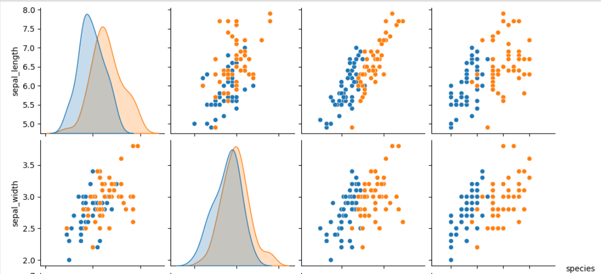
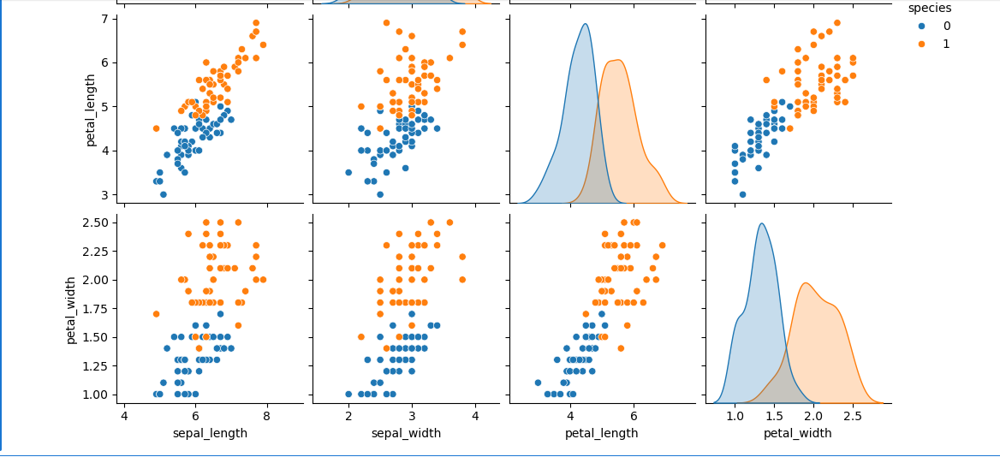

# Logistic Regression on the Iris Dataset

This project demonstrates how to implement **Logistic Regression** on the **Iris dataset** 

It includes model training, evaluation, and visualization of results to better understand the performance of logistic regression for classification tasks.

---


## Overview

Logistic regression is a statistical method for binary or multiclass classification that predicts the probability of an instance belonging to a certain class.  
The **Iris dataset** is a classic dataset in machine learning, containing measurements of iris flowers to classify them into three species:  
- *Iris setosa*
- *Iris versicolor*
- *Iris virginica*

This notebook compares:
- A manual implementation (mathematical formulation + gradient descent)
- A scikit-learn implementation (efficient library-based approach)

---

## Repository Contents

| File / Folder | Description |
|---------------|-------------|
| `Logistic Regression Practical Implementation (Iris dataset).ipynb` | Main Jupyter Notebook containing code for both approaches |
| `images/`| Directory to store plots and visualizations |
| `README.md` | Documentation file |

---

## Getting Started

### Prerequisites

Make sure you have Python 3.x installed.  
Install the required packages:

```bash
pip install numpy matplotlib scikit-learn pandas
````

### Installation

Clone the repository:

```bash
git clone https://github.com/HafsaNoorMuhammad26/logistic-regression-iris-dataset.git
cd logistic-regression-iris-dataset
```

Open the notebook:

```bash
jupyter notebook "Logistic Regression Practical Implementation (Iris dataset).ipynb"
```

---

## Dataset

The Iris dataset contains:

* **150 samples** (50 per species)
* **4 features**:

  * Sepal length
  * Sepal width
  * Petal length
  * Petal width

This dataset is available directly via scikit-learn:

```python
from sklearn.datasets import load_iris
iris = load_iris()
```

---


## Visualizations

Here are sample visual outputs from the notebook:

**EDA Pairplot:**





## References

* [Iris Dataset - UCI Machine Learning Repository](https://archive.ics.uci.edu/ml/datasets/iris)
* [Scikit-learn LogisticRegression Documentation](https://scikit-learn.org/stable/modules/generated/sklearn.linear_model.LogisticRegression.html)
* Logistic Regression theory: [https://towardsdatascience.com/logistic-regression-detailed-overview-46c4da4303bc](https://towardsdatascience.com/logistic-regression-detailed-overview-46c4da4303bc)

---


## 🤝 Contributions

**Author**: Hafsa Noor Muhammad
* 🌐 [LinkedIn](https://www.linkedin.com/in/hafsa-noor-muhammad-67b96331a/)
* 📁 [GitHub](https://github.com/HafsaNoorMuhammad26)

---
